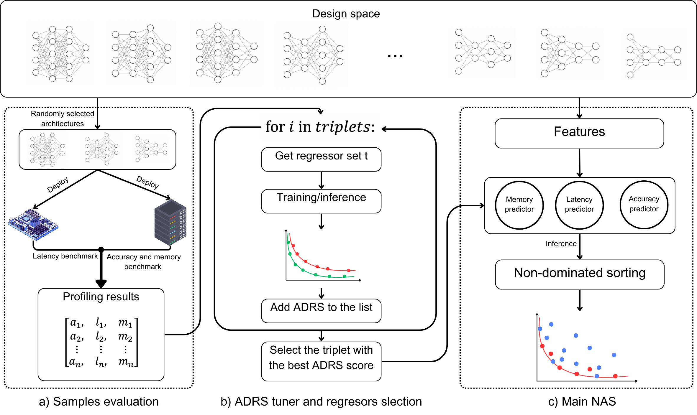

# RAPID (Reimagining Architecture Prediction for Improved)



Hardware-aware Neural Architecture Search (NAS) has become a crucial method for automating the design of efficient models that optimize both accuracy and hardware metrics such as latency and memory footprint.
However, the process is often hindered by the need for frequent model retraining, hardware feedback, and the challenge of balancing conflicting objectives. 
We introduce RAPID, a novel, cost-effective hardware-aware NAS approach that leverages accuracy, latency, and memory predictors to accelerate the search. 
RAPID, by evaluating up to 15\% of design points, can effectively train its predictors, which can be tailored and customized for a wide range of neural network architecture spaces.
This enables the efficient discovery of optimal trade-offs within the search space. 
In the NAS-Bench-201 design space, RAPID achieves more than 7x speedup over existing methods while maintaining top-tier performance in optimizing the trade-offs between model accuracy, latency, and memory footprint.


# Setup

While installing the repository, creating a new conda environment is recommended. Conda installation can be found [here](https://docs.anaconda.com/miniconda/) (Version 23.11.0 or higher)

```bash
conda create -n rapid python=3.9
conda activate rapid
```

All the requirements are listed in [`requirements.txt`](requirements.txt)
```bash
pip install -r requirements.txt
```

# Benchmarks
The profiled dataset of the benchmarks is available in the [`data/`](data/) directory, therefore there's no need to install the following benchmaarks. 
In case  you need to work with the benchmarks, you can find their respective repositories at the following links:
#### [NAS-Bench-201](https://github.com/D-X-Y/NAS-Bench-201)

#### [NAS-Bench-ASR](https://github.com/SamsungLabs/nb-asr)

#### [FlexiBERT](https://github.com/jha-lab/txf_design-space)

#### [HW-GPT-Bench](https://github.com/automl/HW-GPT-Bench)


# Usage
The following subsections explain how to run the ADRS tuner and the NAS itself.


### ADRS tuner
This block can be run by the following command:
```bash
python adrs_tuner.py --dataset DATASET --dir DIR [--train_ratio TRAIN_RATIO] [--val_ratio VAL_RATIO]
```

The `--dataset` argument specifies the path to the target architecture benchmark, which can be selected from the CSV file in the [`data/`](data/) directory. The `--dir` argument specifies the path to save the ADRS tuner results for use later in NAS (the path starts inside the [`tuner/`](tuner/) directory). The training and validation ratios are optional arguments.


#### Example 
This command reads the dataset for the GPT large, on RTX3080 GPU and saves the ADRS tuner results in [`GPT/gpt_l/rtx3080`](GPT/gpt_l/rtx3080)
```bash
python adrs_tuner.py --dataset data/gpt_l_rtx3080.csv --dir GPT/gpt_l/rtx3080 --train_ratio 0.1 --val_ratio 0.1
```

### RAPID NAS
Once the ADRS tuner finds the best predictor triplet for the target architecture, you can run [`rapid.py`](rapid.py) to employ the tailored predictors for NAS. This can be done using the following command:

```bash
python rapid.py [-h] --dataset DATASET --adrs_tuner ADRS_TUNER [--train_ratio TRAIN_RATIO]
```

The `--dataset` argument specifies the path to the target architecture benchmark, which can be selected from the CSV file in the [`data/`](data/) directory. The `--adrs_tuner` argument specifies the path to the output results from the ADRS tuner. The training ratio is also an optional argument.

[`rapid.py`](rapid.py) outputs the selected predictors and their hyperparameters, all the individual metrics of the predictors such as error bands, MSE, and correlations, in addition to ADRS. Additionally, the resulting estimated POF models, along with their accuracy, latency, and memory, are exported in the `NAS_POF.csv` file.


#### Example 
This command reads the dataset for GPT Large on an RTX3080 GPU and runs the NAS based on the results obtained from the ADRS tuner.


```bash
python rapid.py --dataset data/gpt_l_rtx3080.csv --adrs_tuner tuner/GPT/gpt_l/rtx3080/adrs --train_ratio 0.1 
```


#### Mix and match
The ADRS tuner triplets and the target architecture can be mixed and matched to observe the effect of customization. For example, you can use triplets that are fine-tuned for NAS-Bench-201 with GPT-2 NAS.

```bash
python rapid.py --dataset data/gpt_l_rtx3080.csv --adrs_tuner tuner/NASBench201/adrs --train_ratio 0.1 
```


